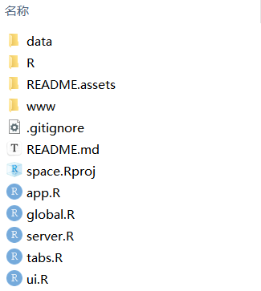

# IMSTAS

**Integrated Multi-modal Skeletal Muscle Transcriptome Analysis System**

IMSTAS (Integrated Multi-modal Skeletal Muscle Transcriptome Analysis System) 是一个基于 **R Shiny** 开发的多模态骨骼肌转录组整合分析系统，用于骨骼肌相关转录组数据的交互式分析与可视化。

------

# Local Deployment and Usage

## 1. Download repository and data

首先将 GitHub 仓库下载到本地：

https://github.com/SEVEN1003/IMSTAS

或使用 git：

```
git clone https://github.com/SEVEN1003/IMSTAS.git
```

由于数据体积较大，未包含在仓库中。
 请发送邮件至：

[1564219373@qq.com](mailto:1564219373@qq.com)

邮件内容：

```
IMSTAS
```

获取 `data` 文件夹。

最终目录结构如下：



------

## 2. Install required R packages

在 R 中加载以下包：

```r
library(shiny)
library(bs4Dash)
library(DT)
library(plotly)
library(colourpicker)
library(shinyWidgets)
library(tidyverse)
library(readxl)
library(clinfun)
library(SCP) # plot sc and set width height
```

如果未安装，可运行：

```r
install.packages(c(
"shiny",
"bs4Dash",
"DT",
"plotly",
"colourpicker",
"shinyWidgets",
"tidyverse",
"readxl",
"clinfun",
"SCP"
))
```

------

## 3. Usage examples

### Introduction interface


### ICN analysis


------

# Citation

If you use **IMSTAS** in your research, please cite the corresponding publication.

```
Wang Z#, Shen W#, Zhang R, et al. NRF1/NFE2L1 orchestrates spatiotemporal regulation of protein degradation network in skeletal muscle. Research Square; 2025. DOI: 10.21203/rs.3.rs-7736640/v1.
```

If the manuscript has not yet been published, please cite the GitHub repository:

```
SEVEN1003. IMSTAS: Integrated Multi-modal Skeletal Muscle Transcriptome Analysis System.
GitHub repository. https://github.com/SEVEN1003/IMSTAS
```

------

# Contact

For data access or questions, please contact:

[1564219373@qq.com](mailto:1564219373@qq.com) 

